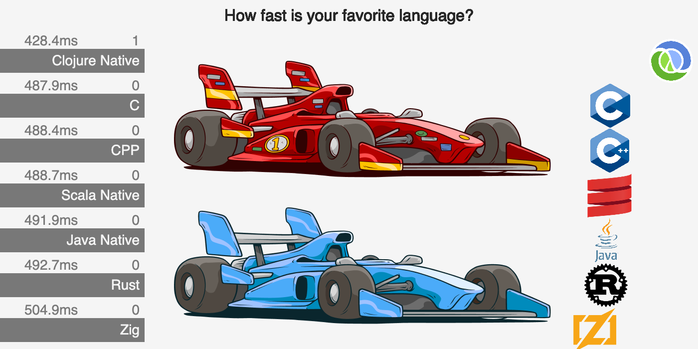

# Languages Visualizations

This a playground for visualizing the the [Languages](https://github.com/bddicken/languages) benchmark of [Benjamin Dicken](https://github.com/bddicken)'s.

* The visualizations are here: [pez.github.io/languages-visualizations/](https://pez.github.io/languages-visualizations/) (There are some more notes about the experiment there.)
* The benchmarks project is [Benjamin Dicken](https://github.com/bddicken)'s **Languages**, here: [github.com/bddicken/languages](https://github.com/bddicken/languages).

## You favorite language is missing?

> If you lack some language in the visualizations, let me know in an issue. If you include instructions on how to get the toolchain installed on a Mac silicon (without any Docker involved) it increases the chances I get the language included.

## How this was built

The visualizations app is written with [Replicant](https://github.com/cjohansen/replicant) (the page with “navigation”) and [Quil](https://github.com/quil/quil) (the animated visualizations). Some of the language logos come from [techicons.dev](https://techicons.dev/).

I hope you fork this project and have some fun with it. 😄

## How to have some fun

You'll need the [Clojure](https://clojure.org) CLI tool (`clojure`), Java, and NodeJS.

1. `npm i`
1. Start the app: `npx shadow-cljs watch app`

When the app is compiled, you can access it on [localhost:9797](localhost:9797)

To play with the code, connect your editor to the [shadow-cljs](https://github.com/thheller/shadow-cljs) REPL and go.

(Or use the REPL Jack-in feature of your favorite Clojure editor.)

### Run benchmarks

See [github.com/bddicken/languages](https://github.com/bddicken/languages) for instructions.

## Share it around, please ❤️

If you share on X, please tag [@pappapez](https://x.com/pappapez) and [@BenjDicken](https://x.com/benjdicken).