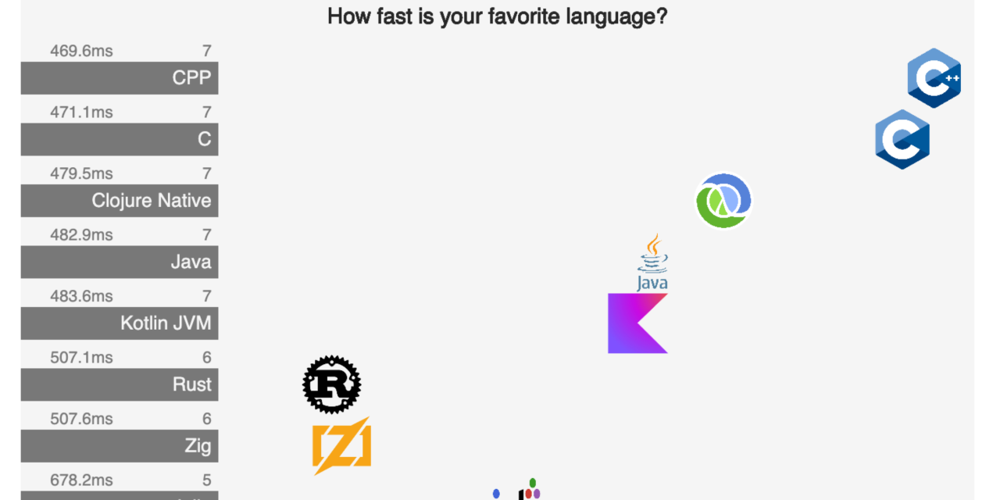

# Languages Visualizations w/ Start Times

This is an experiment in compensating for, and visualizing, the various start times that executables produced by different language have. The simple (and not quite good enough) idea is to benchmark the simplest possible program (Hello World) produced by the language, and subtract the result from the result of some benchmark for the same language. So, if a Java program takes 230ms to run, and the hello-world program takes 40ms, the benchmark result of 190ms is used.

The start time gets visualized at the start of the animation. Even though for fast-to-start programs, when compared to slow-to-start programs, the animation is to quick to be visible. The start time is always displayed a few seconds anyway.

* The visualizations are here: [pez.github.io/languages-visualizations/](https://pez.github.io/languages-visualizations/) (There are some more notes about the experiment there.)
* The benchmarks project is [Benjamin Dicken](https://github.com/bddicken)'s **Languages**, here: [github.com/bddicken/languages](https://github.com/bddicken/languages).

## You favorite language is missing?

> If you lack some language in the visualizations, let me know in an issue. If you include instructions on how to get the toolchain installed on a Mac silicon (without any Docker involved) it increases the chances I get the language included.

## How this was built

The visualizations app is written with [Replicant](https://github.com/cjohansen/replicant) (the page with “navigation”) and [Quil](https://github.com/quil/quil) (the animated visualizations). There's a sprinkle of [Babashka](https://github.com/babashka/babashka) for collecting the JSON files written by the [hyperfine](https://github.com/sharkdp/hyperfine) benchmark runner. Some of the icons come from [techicons.dev](https://techicons.dev/).

I hope you fork this project and have some fun with it. 😄

## Share it around, please ❤️

If you share on X, please tag [@pappapez](https://x.com/pappapez) and [@BenjDicken](https://x.com/benjdicken).